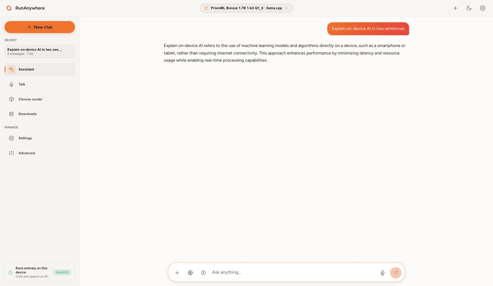
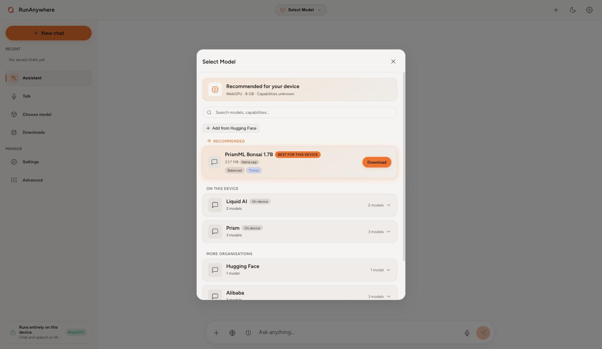
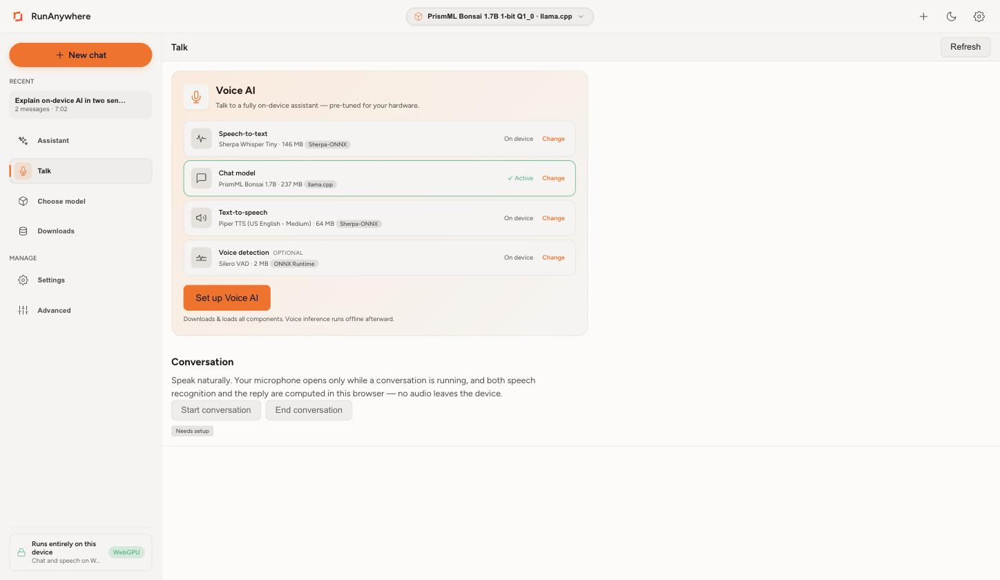
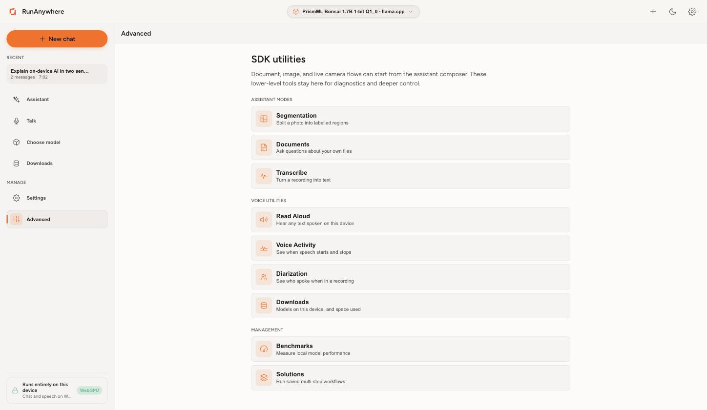
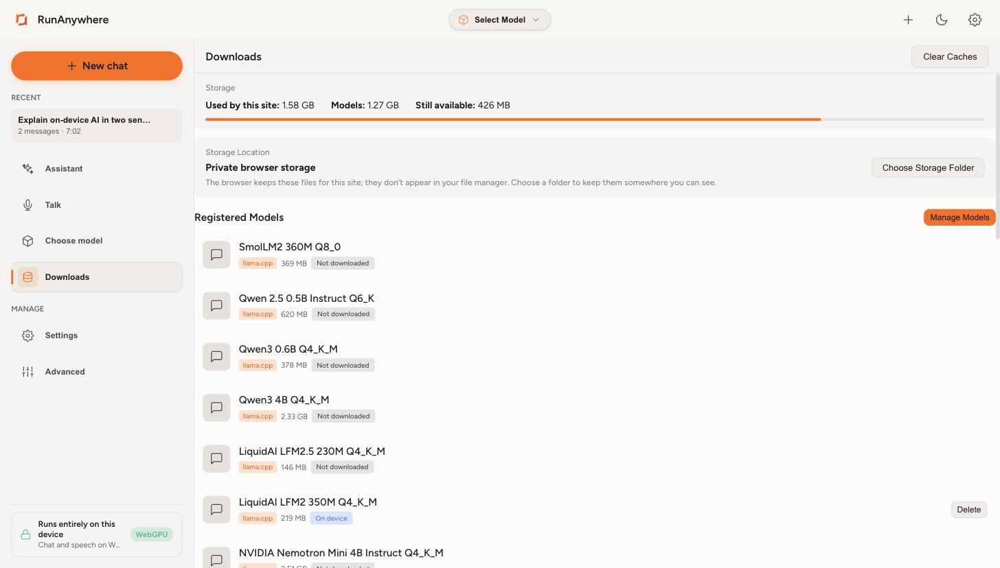
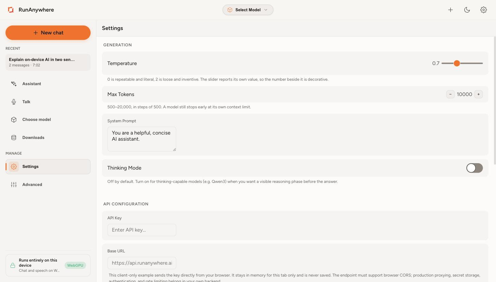

# RunAnywhere AI for the web

<p align="center">
  
</p>

<p align="center">
  <a href="https://runanywhere-web-demo.vercel.app">
    
  </a>
</p>

<p align="center">
  
  
  
  
</p>

The RunAnywhere consumer app for the browser, written in TypeScript.

There is nothing to install. Open the page, pick a model, and it downloads into your browser
and runs there through WebAssembly, with a WebGPU path where your browser and the model both
support it. Whatever you type, say, or upload stays in the tab.

## Try it

**[runanywhere-web-demo.vercel.app](https://runanywhere-web-demo.vercel.app)**

Works in Chrome or Edge 86 and newer, Safari, and Firefox. Models are held in OPFS on your
own disk, so the second visit starts instantly.

<!-- GIF slot: chat with tool calling, the voice session, and image understanding.
     Waiting on the capture pass that follows the current app bug fixes. -->

## What it looks like

Captured in a Chromium browser with WebGPU active, running PrismML Bonsai 1.7B through the
llama.cpp WASM build.

| | |
|---|---|
|  |  |
| An answer generated in the browser tab. The badge in the corner shows WebGPU is in use. | The picker recommends a model for the machine and reports what the browser can do. |
|  |  |
| Talk assembles a speech-to-text, chat, text-to-speech and voice-detection model, then runs the conversation in the tab. | The lower-level surfaces: transcribe, read aloud, voice activity, diarization, segmentation, benchmarks, solutions. |
|  |  |
| What is on disk and what it costs. Browser storage is private to the site unless you pick a folder. | Sampling, the system prompt, and optional API credentials. |

The image files are in [`docs/screenshots/`](docs/screenshots).

## What you can do

| | |
| --- | --- |
| **Assistant** | Streaming chat with tool calling and saved conversations |
| **Talk** | A full voice session: it listens, thinks, and answers out loud |
| **Image and Live** | Describe a photo, or a live camera frame |
| **Transcribe** | Batch and streaming speech to text |
| **Read aloud** | Speak any text you give it |
| **Documents** | Drop in `.txt`, `.md`, or `.json` and ask questions about them |
| **Solutions** | Two packaged pipelines: a voice agent and document Q&A |
| **Benchmarks** | One prompt at three token budgets, charted |
| **Downloads** | Model registry, disk usage, storage folder |

Segmentation and Diarization have views wired up, but no browser engine registers those
capabilities yet, so both tabs show an unavailable placeholder.

## Build it yourself

```bash
git clone https://github.com/RunanywhereAI/runanywhere-web.git
cd runanywhere-web

npm ci
npm run dev      # http://localhost:3000
```

`npm ci` pulls the SDK and every WASM artifact with it. There is no separate WASM build step
and no Emscripten toolchain to install. You need Node 22.12 or newer.

The one thing that trips people up: the page has to be cross-origin isolated for
`SharedArrayBuffer`. The dev server and `vercel.json` both send COOP `same-origin` and COEP
`require-corp`, and `public/coi-serviceworker.js` covers hosts that cannot.

[`docs/DEVELOPMENT.md`](docs/DEVELOPMENT.md) has the scripts table, the WASM artifact list,
deployment configuration, and troubleshooting.

## Architecture

Four npm packages, no monorepo checkout, no source aliases. What `npm install` resolves is
what the app runs against, currently `0.20.24`.

```
        index.html  →  main.ts  →  app.ts
        boot screen    SDK init    shell, routing, views
                          │
        ┌─────────────────┴──────────────────┐
        │        @runanywhere/web            │  lifecycle + facades
        └─────────────────┬──────────────────┘
                          │
        ┌─────────────────┼──────────────────┐
        │                 │                  │
  web-llamacpp        web-onnx          proto-ts
  LLM · VLM        STT·TTS·VAD·embed    generated types
  CPU + WebGPU      CPU + WebGPU
                          │
                          ▼
             racommons.wasm, the same C++ core
        that ships in the Swift, Kotlin, and Electron apps
```

Views call `RunAnywhere.*` and nothing deeper. They may import `@runanywhere/web` and
`@runanywhere/web/browser`, never `/internal` or `/backend`, and they do not reimplement
routing, storage, or inference rules in UI code.

Every surface has a URL fragment (`#/vision`, `#/benchmarks`), so a tab survives a refresh, a
pasted link, and the reload the isolation service worker performs on Safari.

| Reference | |
| --- | --- |
| Which SDK call each view makes | [`docs/reference/sdk-surface-by-view.md`](docs/reference/sdk-surface-by-view.md) |
| WASM artifacts and how they are copied | [`docs/reference/wasm-artifacts.md`](docs/reference/wasm-artifacts.md) |
| Building, deploying, troubleshooting | [`docs/DEVELOPMENT.md`](docs/DEVELOPMENT.md) |
| Contributor conventions | [`AGENTS.md`](AGENTS.md) |

## The other apps

| Platform | Repo |
| --- | --- |
| iOS and macOS, Swift | [runanywhere-ios](https://github.com/RunanywhereAI/runanywhere-ios) |
| Android, Kotlin | [runanywhere-android](https://github.com/RunanywhereAI/runanywhere-android) |
| Windows, Electron | [runanywhere-electron](https://github.com/RunanywhereAI/runanywhere-electron) |
| SDK monorepo | [runanywhere-sdks](https://github.com/RunanywhereAI/runanywhere-sdks) |
| Documentation | [docs.runanywhere.ai](https://docs.runanywhere.ai) |
| Discord | [discord.gg/N359FBbDVd](https://discord.gg/N359FBbDVd) |

## License

RunAnywhere License, Apache 2.0 based with additional commercial-use terms. See
[LICENSE](LICENSE).
